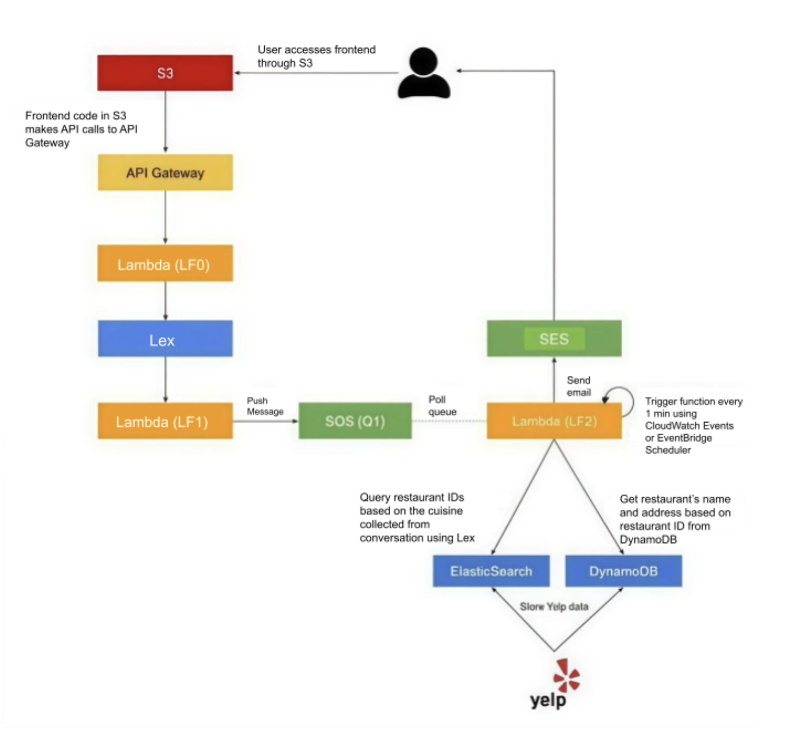

# Dining Concierge Chatbot

Customer Service is a core service for a lot of businesses around the world and it is getting disrupted now by Natural Language Processing-powered applications. In this project we implemented a fully serverless, microservice driven web application. Specifically, we built a Dining Concierge chatbot that sends restaurant suggestions given a set of preferences that the user provides the chatbot with through conversation. It integrates multiple AWS services end-to-end, beginning with conversational AI (Lex) and ending with automated restaurant suggestions delivered over email.

The chatbot is live at [https://mathew-martin.github.io/dining-concierge/](https://mathew-martin.github.io/dining-concierge/)

Demo: [https://youtu.be/y-f1wL_kKlE](https://youtu.be/y-f1wL_kKlE)

## Architecture

```
Lex Bot → Lambda (validation) → SQS Queue → 
Lambda Consumer → DynamoDB + OpenSearch → SES Email → User
```

Components:

- **Static HTML/JS frontend** 
- **API Gateway** - to expose the chatbot backend
- **Amazon Lambda** - serverless compute for intent processing and queue consumption
- **Amazon Lex** - chatbot interface to capture user input
- **Amazon SQS** - reliable message queue and dead-letter queue for failed requests
- **Amazon DynamoDB** - persistent restaurant metadata store
- **Amazon OpenSearch** - indexed search for restaurant filtering by cuisine
- **Amazon SES** - sends personalized restaurant suggestions via email

   <!--  -->
   

---

# 🚀 Features

✔️ Conversational booking flow using Lex
✔️ Validation Lambda for slot elicitation
✔️ SQS queue for decoupled processing
✔️ DLQ for failed messages
✔️ DynamoDB for restaurant details
✔️ OpenSearch for cuisine-based search
✔️ SES email delivery
✔️ API Gateway SDK integration
✔️ Fully working HTML frontend

---

# 📁 Project Structure

```
/
├── docs/
│   ├── chat.html
│   ├── assets/js/sdk/
│   └── assets/css/
├── lambda_functions/
│   ├── lambda_function_0.py
│   ├── lambda_function_1.py 
│   └── lambda_function_2.py
├── other-scripts/
|   └── yelp_to_dynamo.py
└── README.md
```

---

# 🧩 Part 1 — AWS Lex Chatbot

### ✓ Created Lex V2 bot with the following:

* **Intent:** `DiningSuggestionsIntent`
* **Slots:**

  * `City`
  * `Cuisine`
  * `Date`
  * `Time`
  * `NumGuests`
  * `Email`

### ✓ Issues fixed:

* Bot skipping slots (City/Cuisine/Guests) → fixed by adjusting **slot elicitation settings**
* Time slots fixed by enabling **time expressions**
* Added **fulfillment code hook** (Lambda)

---

# 🧩 Part 2 — Lambda Validation Function (LF0)

This Lambda validates:

* Date is not past
* Time format is valid
* Guests is between 1–20
* Cuisine from allowed list
* City is NYC only

Also sends dialog responses back to Lex to:

* Elicit slots
* Confirm slot values
* Close conversation

---

# 🧩 Part 3 — SQS + DLQ Integration

### ✓ Setup:

* Main Queue → `DiningRequestsQueue`
* Dead Letter Queue → `DiningRequestsDLQ`
* Redrive Policy: **Max Receives = 3**

### ✓ Verified:

* Messages appear with **ReceiveCount**
* After 3 failed attempts → message moves to **DLQ**

---

# 🧩 Part 4 — Lambda to Push Messages to SQS (LF1)

Triggered after Lex passes all slots.
This Lambda:

* Extracts slots from Lex request
* Packages JSON:

```json
{
  "city": "Manhattan",
  "cuisine": "Mexican",
  "date": "2025-02-21",
  "time": "19:00",
  "guests": "3",
  "email": "example@gmail.com"
}
```

* Pushes message to SQS using:

```python
sqs.send_message(QueueUrl=QUEUE_URL, MessageBody=json.dumps(payload))
```

---

# 🧩 Part 5 — DynamoDB + OpenSearch Setup

### DynamoDB table:

* **Table Name:** `yelp-restaurants`
* **Primary Key:** `business_id`

Imported 5000+ restaurant documents from Yelp dataset.

### OpenSearch Domain:

* Created domain
* Enabled master user
* Created index:

```
restaurants
```

### Type mapping:

```
Restaurant
```

### Added documents via bulk ingestion:

Used:

* `_bulk` API
* Corrected syntax errors
* Used "POST restaurants/_doc" for indexing

---

# 🧩 Part 6 — Lambda Consumer (LF2)

This is the main processing Lambda:

### Steps performed:

1. Poll SQS event
2. Extract user request
3. Query OpenSearch:

```json
{
  "query": {
    "match": { "cuisine": "<cuisine>" }
  }
}
```

4. Get top 3 restaurants
5. Fetch details from DynamoDB
6. Format email
7. Send email via SES

### SES Setup:

* Verified sender email
* Set region (us-east-1)
* Configured production mode

---

# 🧩 Part 7 — API Gateway

* Created **REST API**
* Added resources and POST method
* Integrated with LF0 & LF1
* Generated **SDK**
* Moved SDK → `frontend/assets/js/sdk/`
* Tested CORS, enabled correctly

---

# 🧩 Part 8 — Frontend Integration

### Final Working Flow:

1. User types message
2. JS sends text to API Gateway
3. API calls Lex
4. Lex → Lambda → SQS → Lambda → SES
5. User receives restaurant suggestions via email

---

# 🧪 Testing and Debugging

### Verified:

* SQS messages appearing
* Messages moving to DLQ
* OpenSearch queries working
* SES email delivery successful
* Frontend connected to API
* Lex conversation flow smooth

### Common fixes:

* IAM permissions
* CORS headers
* Updating SDK files
* Rebuilding API Gateway deployment

---

# 📬 Final Output Example (SES Email)

```
Hello! Here are your top restaurant recommendations:

1. Dos Toros — Mexican — 4.5⭐  
2. Tacombi — Mexican — 4.2⭐  
3. Chipotle — Mexican — 4.0⭐  

Date: Friday 7 PM  
Location: Manhattan  
Guests: 3

Enjoy your meal!
```

---

# 📚 Technologies Used

* **AWS Lex V2**
* **AWS Lambda**
* **AWS SQS + DLQ**
* **AWS DynamoDB**
* **AWS OpenSearch**
* **AWS SES**
* **AWS API Gateway**
* **HTML/CSS/JavaScript Frontend**
* **IAM & Access Policies**
* Optional: Terraform/CloudFormation

---
